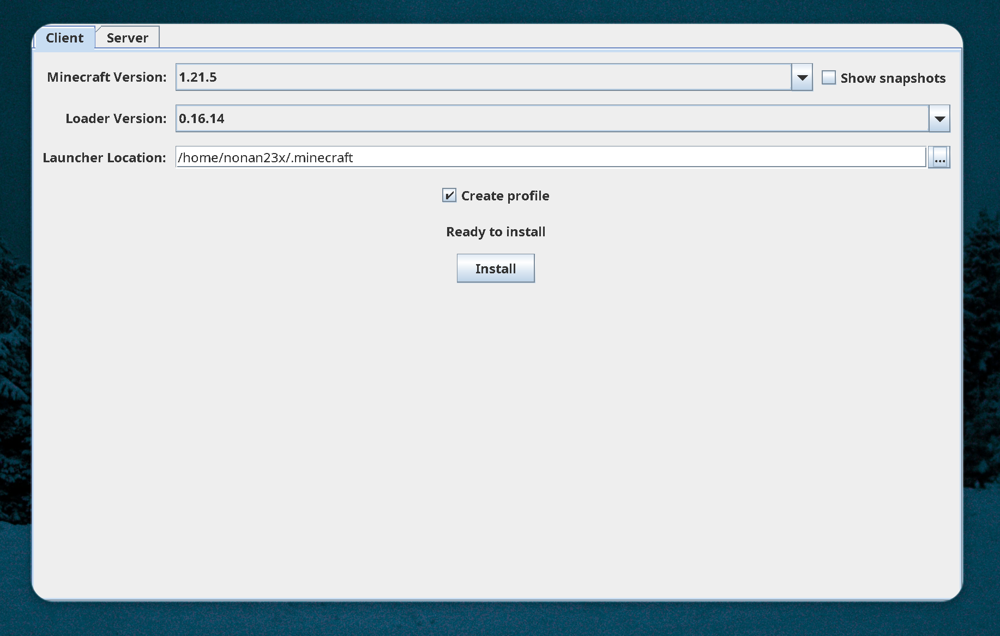

<div align="center">

# Minecraft Sync 🚀


<br>

## Prerequisites ⚙️

</div>

Before installing Minecraft Sync, make sure you have these essentials:

1. **Java 21 or higher** - Download from [Oracle](https://www.oracle.com/java/technologies/downloads/) or [OpenJDK](https://openjdk.org/)
> 💡 **Tip:** Check your Java version by running `java -version` in terminal/command prompt
2. **Minecraft Launcher** - Official launcher from [minecraft.net](https://www.minecraft.net/download) or third-party launchers like [MultiMC](https://multimc.org/) or [Prism Launcher](https://prismlauncher.org/)
3. **Fabric Loader** - Click here to install [Fabric Loader](https://maven.fabricmc.net/net/fabricmc/fabric-installer/1.0.3/fabric-installer-1.0.3.exe) to enable mod support
    - Run the executable and ensure the Minecraft Version is set to 1.21.5, then click the install button
    


<br>

<div>

## Installation 📦

</div>

1. **Install Git** - Download from [git-scm.com](https://git-scm.com/)
2. **Install UV package manager** - Use these quick commands:
    
    - **Windows (PowerShell/Terminal/CommandPrompt):**
        ```powershell
        powershell -ExecutionPolicy ByPass -c "irm https://astral.sh/uv/install.ps1 | iex"
        ```
        
    - **Linux/macOS:**
        ```bash
        curl -LsSf https://astral.sh/uv/install.sh | sh
        ```
> ⚠️ Notice: Restart your terminal so that git and uv reflect on your PATH

3. **Clone the repository**
    ```bash
    git clone https://github.com/nonan23x/minecraft-sync.git
    cd minecraft-sync
    ```
4. **Install dependencies**
    ```bash
    uv sync
    ```
5. **Run the application**
    ```bash
    uv run main.py
    ```

That's it! You're ready to play Minecraft 2.0! 🎉

> ⚠️ Notice: When entering the game from launcher menu, make sure to select the new fabric profile created by the tool you ran in prerequisites

<br>

<div align=center>

## Purpose 🎯

Minecraft Sync was born out of frustration with the endless hassle of getting friends' Minecraft setups to match mine! 😤 If you've ever spent hours walking non-tech-savvy friends through mod installations, config tweaks, and version matching just to play together, you know the pain. This tool was originally created for my personal use and my friend group - because life's too short to troubleshoot mod conflicts when you just want to build and explore together! 🎮👥

<br>

## Supported Platforms 🖥️


<br>

## Why Use Minecraft Sync? 💡

- 🐌 **Fix Vanilla Performance Issues** - Tired of 30 FPS on a decent PC? Sodium + Lithium combo delivers 3x better performance
- 🎨 **Enhanced Visuals Made Easy** - Pre-configured Iris shaders with BSL and Continuum for jaw-dropping graphics without the headache
- 📦 **Curated Mod Collection** - Hand-picked QOL mods that actually matter - no bloat, just improvements
- 🖼️ **Faithful Resource Packs** - Consistent visual overhaul that respects Minecraft's original aesthetic
- 🔧 **Skip the Config Hell** - All mods pre-tuned and compatible - no more crashes from conflicting settings
- 👥 **Everyone Stays Updated** - Your friends get the exact same setup automatically, no more "why doesn't my game look like yours?"

Stop fighting with mod incompatibilities and outdated tutorials! 🎮✨

</div>